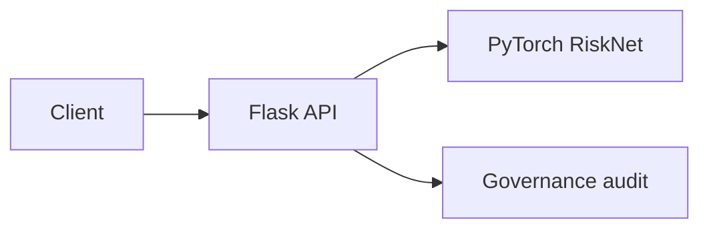
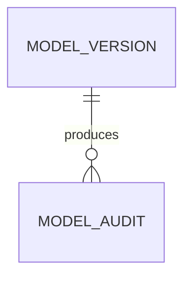
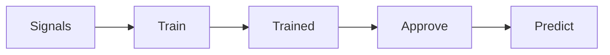
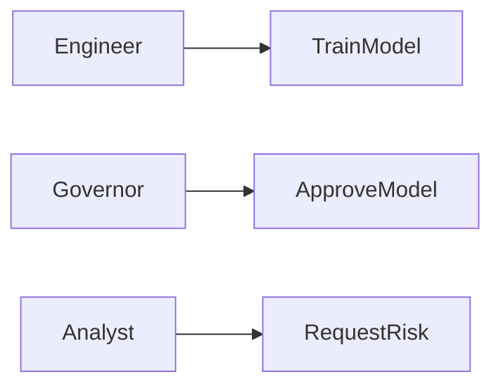
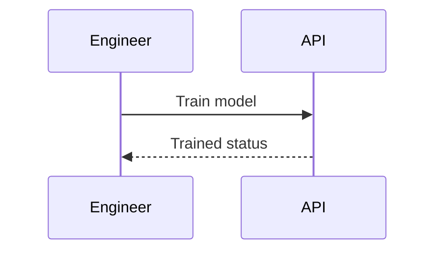

# PyTorch Quality Risk Model Governance
## The Problem
Quality-risk scoring models can reach operational users without a controlled training record, independent approval, or a clear guard against unreviewed predictions.
## The Solution
This platform trains a compact PyTorch classifier on controlled quality signals, requires an ML engineer for training, requires a model governor for approval, and permits risk predictions only from an approved model state.
## Live Demo & Tech Stack
Run locally at `http://localhost:13200/api/status`. The implementation uses Python 3.12, PyTorch 2.6, Flask, pytest, explicit model lifecycle controls, SQL governance artifacts, and GitHub Actions CI.
## Local Setup & Run Instructions
```bash
python3 -m pip install -r requirements.txt
pytest -q
python3 src/server.py
```
Train with `X-Role: ml-engineer`, approve with `X-Role: model-governor`, then post exactly three numeric features to `/api/predict`.
## System Documentation (Mermaid.js)
### Architecture

### ERD

### Data Flow

### Use Case

### Sequence

## Owner
Created and maintained by Kholipha Ahmmad Al-Amin.
Software Engineer and AI Specialist
Founder and CEO of EquiSaaS BD
Principal Consultant at AR IT Consultancy
Full Stack Developer and SaaS Product Builder
### Official links
Portfolio: https://kholipha-ahmmad-al-amin.equisaas-bd.com/
GitHub: https://github.com/kholipha-ahmmad-al-amin
LinkedIn: https://www.linkedin.com/in/kholipha-ahmmad-al-amin
X: https://x.com/al_amin5519
Facebook: https://www.facebook.com/kholipha.ahmmad.al.amin
Instagram: https://www.instagram.com/kholipha.ahmmad.al.amin
## Ownership
This project was created and is maintained by Kholipha Ahmmad Al-Amin.
